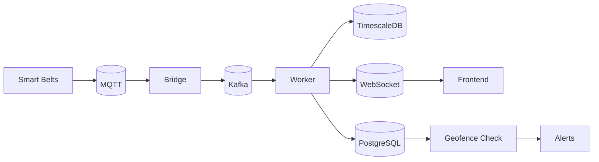

# Livestock Tracking Platform

A real-time monitoring system for tracking cattle and livestock using GPS-enabled smart belts with temperature monitoring, activity tracking, and geofence breach alerts..

## Features

- **Real-time Location Tracking** - Live GPS coordinates of all tracked animals
- **Temperature Monitoring** - Continuous temperature monitoring with alerts
- **Activity Level Tracking** - Monitor animal movement patterns
- **Geofence Alerts** - Instant notifications when animals leave designated areas
- **Interactive Dashboard** - Web interface with maps and charts
- **RESTful API** - Complete API for system integration
- **WebSocket Support** - Real-time data updates

## Technology Stack

### Backend
- FastAPI - Python web framework
- PostgreSQL with PostGIS - Relational database with spatial extensions
- TimescaleDB - Time-series database for telemetry
- Apache Kafka - Distributed event streaming
- MQTT - Lightweight IoT messaging

### Frontend
- Next.js 16 - React framework
- React-Leaflet - Interactive maps
- ECharts - Data visualization
- Zustand - State management
- Tailwind CSS - Styling

## Quick Start

### Prerequisites
- Docker and Docker Compose
- Make utility

### Run All Services

```bash
# Clone the repository
git clone https://github.com/charithmadhuranga/Live-Stock-Tracking-with-kafka
cd Live-Stock-Tracking-with-kafka

# Start all services
make up

# View the dashboard
open http://localhost:3000

# View API docs
open http://localhost:8000/docs
```

## Make Commands

```bash
# Start all services
make up                      # Start everything
make up API=1               # Start API only
make up FRONTEND=1          # Start frontend only

# Stop services
make down                    # Stop all services

# View logs
make logs                   # All logs
make logs API=1             # API logs only
make logs WORKER=1          # Worker logs only

# Rebuild services
make rebuild              # Rebuild all
make rebuild API=1         # Rebuild API
make rebuild FRONTEND=1    # Rebuild frontend

# Clean up
make clean                 # Remove containers and volumes

# Run tests
make test                  # Run tests (if available)

# Documentation
make docs-dev            # Start documentation dev server
make docs-prod           # Build documentation for production
make docs-serve          # Serve built documentation
```

## Services

| Service | URL | Description |
|---------|-----|-------------|
| Frontend | http://localhost:3000 | Web dashboard |
| API | http://localhost:8000 | REST API |
| API Docs | http://localhost:8000/docs | Swagger documentation |
| Kafka | localhost:9092 | Message broker |
| MQTT | localhost:1883 | IoT messaging |
| PostgreSQL | localhost:5432 | Main database |
| TimescaleDB | localhost:5433 | Telemetry database |

## Architecture



## Development

### Backend Development

```bash
# Install dependencies
pip install -r requirements.txt

# Run API locally
python -m uvicorn app.main:app --reload --port 8000
```

### Frontend Development

```bash
cd frontend
npm install
npm run dev
```

### Run Simulator

```bash
# Simulates 5 smart belts sending telemetry
python scripts/realtime_simulator.py
```

## Configuration

Environment variables (set in docker-compose.yml):

| Variable | Default | Description |
|----------|---------|-------------|
| DATABASE_URL | postgresql://...@postgres:5432 | PostgreSQL connection |
| TIMESCALE_URL | postgresql://...@timescale:5432 | TimescaleDB connection |
| KAFKA_BOOTSTRAP_SERVERS | kafka:9092 | Kafka broker |
| MQTT_BROKER_HOST | mosquitto | MQTT broker host |
| DEBUG | true | Enable debug logging |

## Testing Data

```bash
# Create test paddocks and animals
python scripts/feed_test_data.py
```

## Documentation

Full documentation available at [docs/](docs/)

- [Architecture](docs/architecture.md) - System design
- [Data Flow](docs/data-flow.md) - Data processing
- [Backend](docs/backend.md) - API documentation
- [Frontend](docs/frontend.md) - Frontend guide
- [Database](docs/database.md) - Database schema
- [Deployment](docs/deployment.md) - Deployment guide
- [Contributing](docs/contributing.md) - Development guide

## API Endpoints

### Paddocks
- `GET /api/paddocks` - List all paddocks
- `POST /api/paddocks` - Create paddock

### Animals
- `GET /api/animals` - List all animals
- `POST /api/animals` - Create animal

### Telemetry
- `GET /api/telemetry/latest` - Get latest telemetry for all belts
- `GET /api/telemetry/{belt_id}` - Get telemetry history

### WebSocket
- `ws://localhost:8000/ws/telemetry` - Real-time telemetry stream

## License

MIT License

## Contributing

See [CONTRIBUTING.md](docs/contributing.md) for development guidelines.