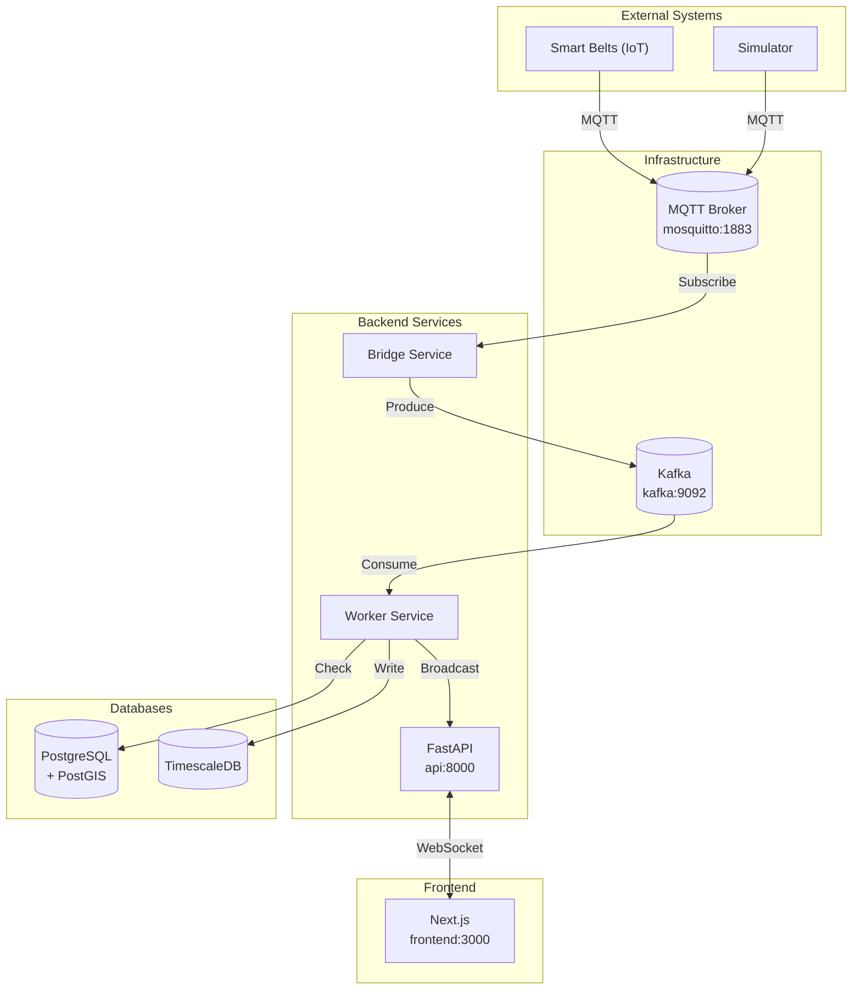
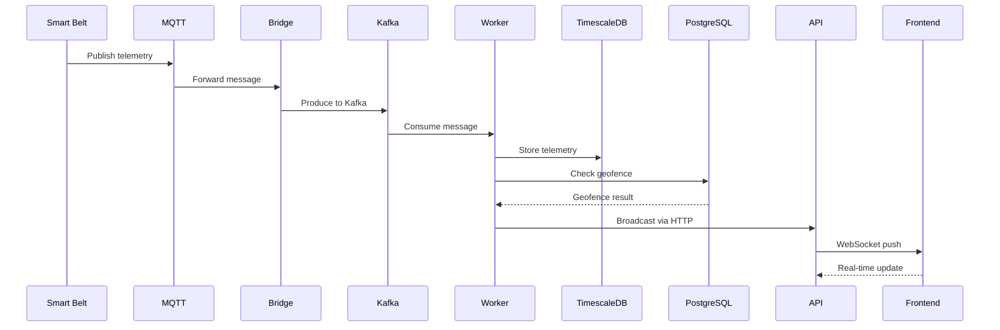
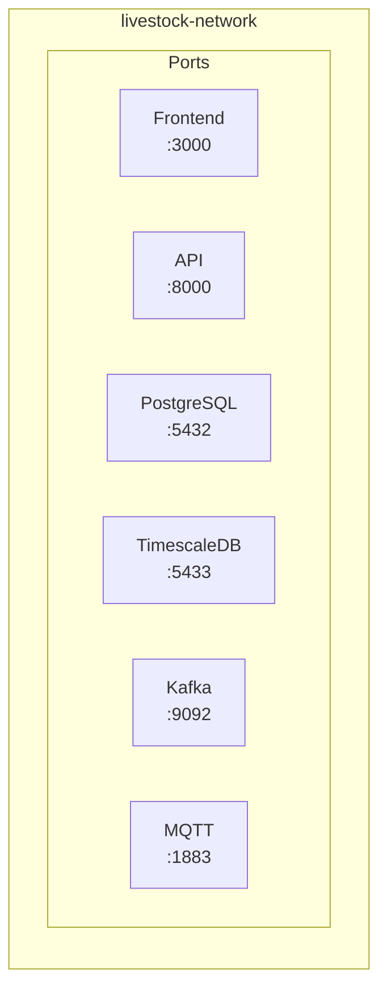

# System Architecture

This document provides an overview of the Livestock Tracking Platform architecture, explaining how each component works and how they interact with each other.

## High-Level Architecture

The Livestock Tracking Platform follows a **microservices-inspired architecture** with the following main components:

## Component Overview

### 1. Smart Belts (IoT Devices)

The **Smart Belts** are GPS-enabled devices attached to livestock animals. They collect and transmit:

- **GPS Coordinates** - Latitude and longitude
- **Temperature** - Body temperature readings
- **Activity Level** - Movement/activity metrics
- **Timestamp** - When the reading was taken

These devices transmit data via **MQTT** (Message Queuing Telemetry Transport) to the MQTT broker.

### 2. MQTT Broker (Mosquitto)

The **MQTT Broker** (Eclipse Mosquitto) acts as the central hub for IoT communications:

- Receives telemetry data from smart belts
- Uses a lightweight publish/subscribe model
- The **Bridge Service** subscribes to telemetry topics and forwards data to Kafka

**Default Configuration:**
- Port: 1883
- Topic Pattern: `livestock/telemetry/{belt_id}`

### 3. Kafka Message Broker

**Apache Kafka** provides reliable, scalable message streaming:

- **Topics:**
  - `telemetry_raw` - Raw telemetry data from belts
  - `alerts` - Geofence breach alerts

- **Consumers:**
  - Worker Service consumes from `telemetry_raw`
  - Processes and stores data in databases

### 4. Worker Service

The **Worker Service** processes telemetry data:

1. **Consumes** messages from Kafka `telemetry_raw` topic
2. **Stores** telemetry in TimescaleDB for time-series analysis
3. **Checks** geofence compliance using PostGIS
4. **Broadcasts** data to connected WebSocket clients
5. **Creates alerts** for geofence breaches

### 5. FastAPI Backend

The **FastAPI Backend** provides the REST API:

- **Endpoints** for animals, paddocks, telemetry
- **WebSocket** for real-time updates
- **Internal endpoints** for broadcasting from workers

**Key Endpoints:**
- `GET /api/paddocks` - List all paddocks
- `GET /api/telemetry/latest` - Get latest telemetry
- `GET /api/animals` - List all animals
- `WS /ws/telemetry` - WebSocket for real-time data

### 6. PostgreSQL Database

**PostgreSQL** with **PostGIS** extension stores:

- **Animals** - Livestock information
- **Paddocks** - Geofenced areas with geometry data
- Spatial queries for geofence checking

### 7. TimescaleDB

**TimescaleDB** (PostgreSQL extension) stores:

- **Telemetry** - Time-series sensor data
- Optimized for time-series queries
- Automatic data partitioning

### 8. Next.js Frontend

The **Frontend** provides the user interface:

- **Dashboard** - Main view with map and charts
- **Map View** - Interactive Leaflet map with animal markers
- **Charts** - ECharts for temperature and activity visualization
- **Alert Table** - Geofence breach alerts
- **Real-time Updates** - WebSocket connection for live data

## Data Flow

Detailed documentation available in [Data Flow](data-flow.md)

## Network Architecture

All services run in Docker containers within a shared network:

| Service | Port | Description |
|---------|------|-------------|
| Frontend | 3000 | Next.js web application |
| API | 8000 | FastAPI backend |
| PostgreSQL | 5432 | PostgreSQL with PostGIS |
| TimescaleDB | 5433 | TimescaleDB for telemetry |
| Kafka | 9092 | Kafka message broker |
| MQTT | 1883 | MQTT broker |
| Zookeeper | 2181 | Zookeeper for Kafka |

## Development vs Production

### Development
- All services run locally via Docker Compose
- Hot reload for frontend (via volume mounts)
- Debug logging enabled

### Production
- Separate containers for each service
- Optimized builds
- Environment-based configuration

See [Deployment](deployment.md) for production setup.
