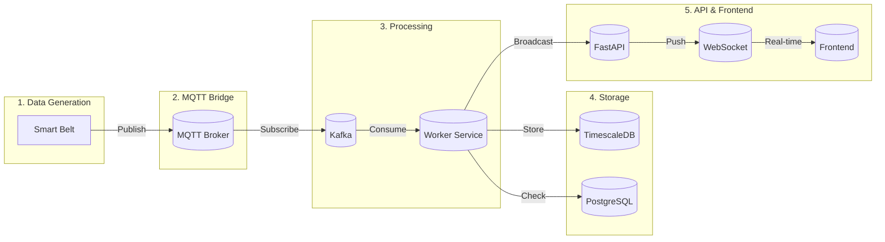
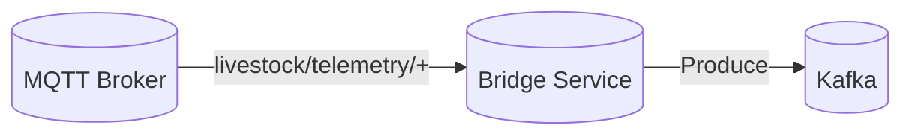
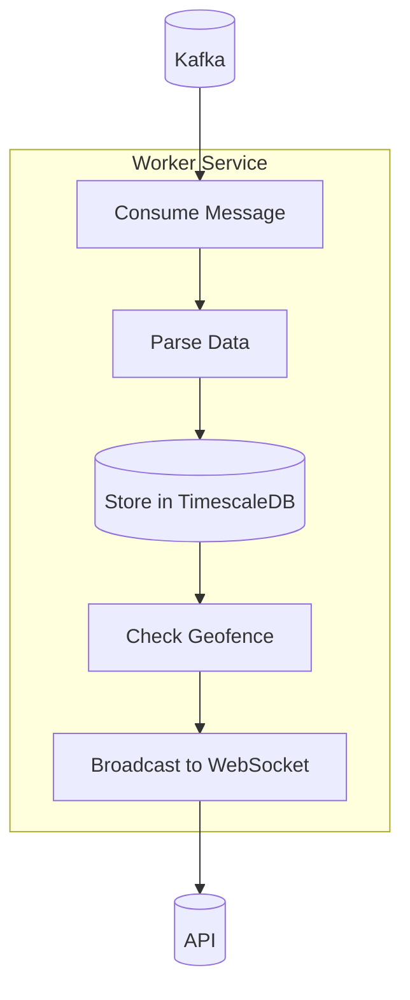
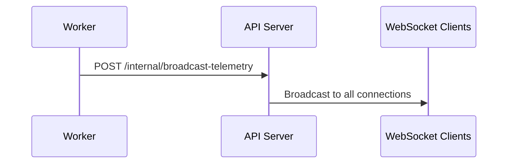
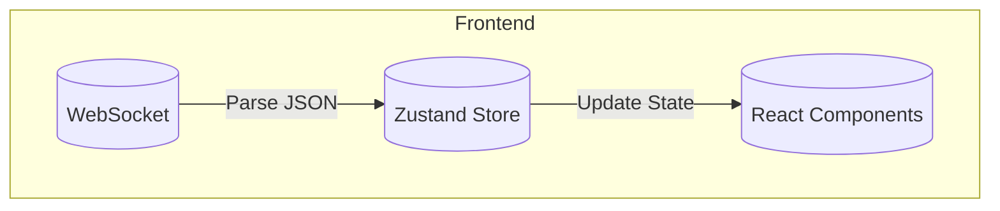
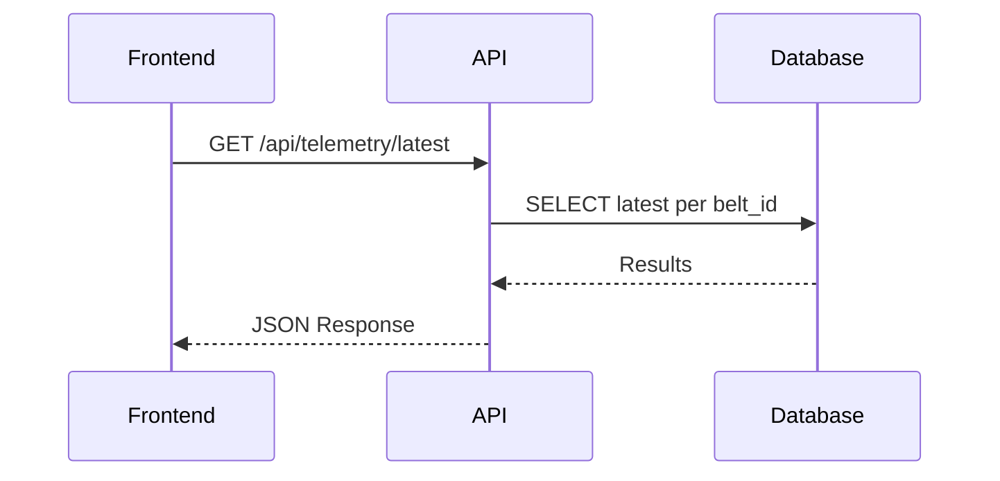
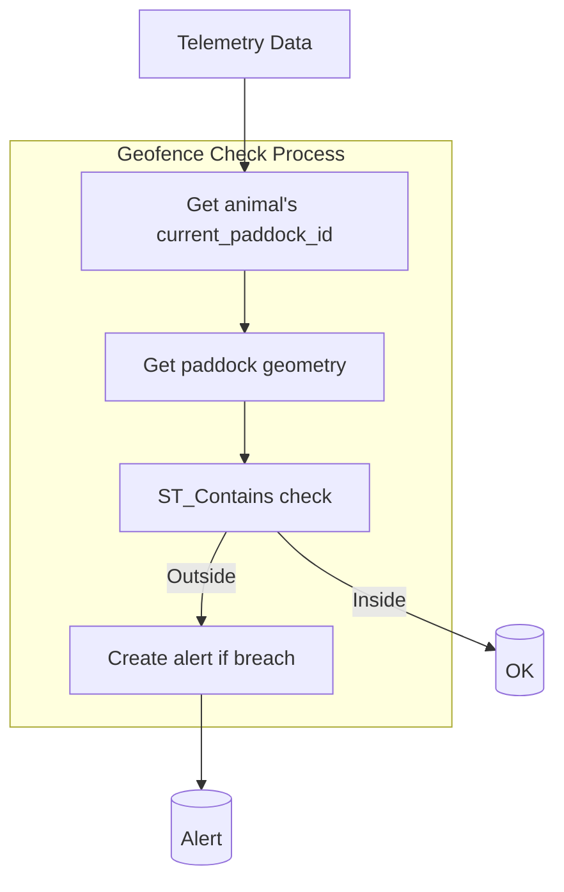

# Data Flow

This document explains how data flows through the Livestock Tracking Platform from the IoT devices to the user interface.

## Overview

The platform follows a **streaming architecture** where data flows continuously from smart belts through various processing stages to the final user interface:



## Step-by-Step Data Flow

### 1. Data Generation (Simulation)

The **Simulator** generates fake telemetry data to simulate smart belts:

**File:** `scripts/realtime_simulator.py`

```python
# Example telemetry payload
{
    "belt_id": "BELT-001",
    "latitude": -36.595,
    "longitude": 144.945,
    "temperature": 38.5,
    "activity_level": 5.0,
    "timestamp": 1713724800
}
```

The simulator publishes this data to the MQTT broker on topics like:
- `livestock/telemetry/BELT-001`
- `livestock/telemetry/BELT-002`
- etc.

### 2. MQTT to Kafka Bridging

The **Bridge Service** subscribes to MQTT topics and forwards messages to Kafka:

**File:** `app/worker/mqtt_to_kafka_bridge.py`



Key operations:
1. Connects to MQTT broker
2. Subscribes to `livestock/telemetry/#` (all belt topics)
3. Parses JSON payload
4. Converts to Protocol Buffer format
5. Produces to Kafka `telemetry_raw` topic

### 3. Kafka Consumer (Worker)

The **Worker Service** consumes from Kafka and processes the data:

**File:** `app/worker/kafka_consumer.py`



Processing steps:
1. **Consume** message from Kafka
2. **Parse** protobuf or JSON data
3. **Store** in TimescaleDB (`telemetry` table)
4. **Check** geofence (is animal in expected paddock?)
5. **Broadcast** to WebSocket clients via API
6. **Create alert** if geofence breach detected

### 4. WebSocket Broadcasting

The Worker calls an internal API endpoint to broadcast data to connected WebSocket clients:

**File:** `app/api/broadcast.py`



### 5. Frontend Data Reception

The **Frontend** connects to the WebSocket and updates the UI in real-time:

**File:** `frontend/src/lib/telemetry.ts`



## API Data Flow (Polling)

The frontend also supports REST API polling as a fallback:



## Geofence Checking Flow



Steps:
1. Get animal's current_paddock_id from database
2. Get paddock geometry
3. Check if point is inside polygon using ST_Contains
4. If NOT within paddock:
   - Create alert
   - Store in alerts table
   - Broadcast via WebSocket

## Error Handling

### MQTT Connection Lost
- Bridge automatically reconnects to MQTT broker
- Logs warning: "Disconnected from MQTT broker"

### Kafka Consumer Error
- Worker logs error and continues processing
- Failed messages are logged but not requeued

### WebSocket Disconnection
- Frontend attempts to reconnect after 3 seconds
- Status indicator shows "Disconnected"

### Database Connection Error
- SQLAlchemy handles connection pooling
- Errors are logged and reported via API

## Performance Considerations

1. **Kafka** provides message buffering during high load
2. **TimescaleDB** optimizes time-series queries
3. **WebSocket** reduces HTTP polling overhead
4. **PostGIS** efficiently handles spatial queries
5. **Connection pooling** via SQLAlchemy NullPool in Docker