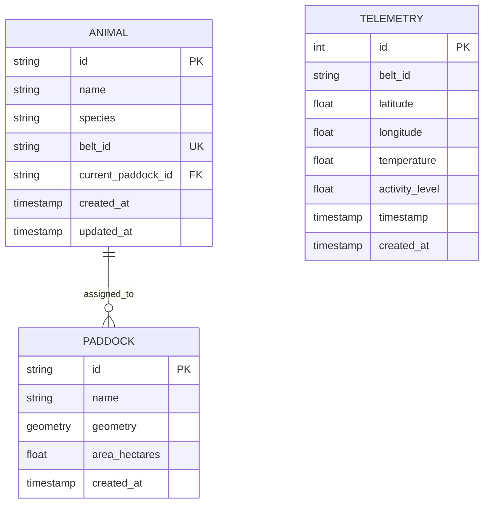
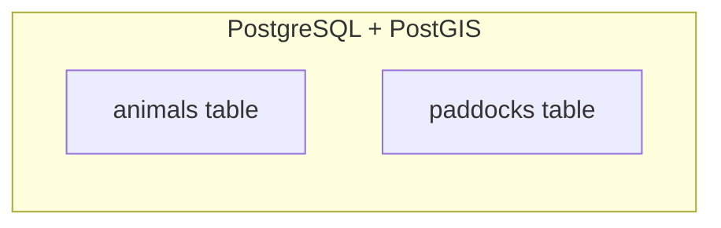
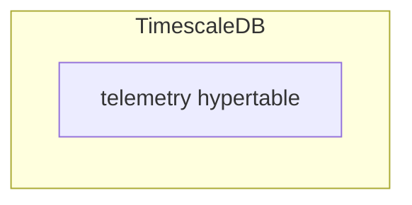

# Database Documentation

The platform uses two PostgreSQL databases:
1. **PostgreSQL with PostGIS** - For animals and paddocks
2. **TimescaleDB** - For time-series telemetry data

## Database Architecture



### PostgreSQL Database (Main)

Stores animals and paddocks:



### TimescaleDB (Telemetry)

Stores time-series sensor data:



## SQLAlchemy Models

### Animal Model

**File:** `app/models/__init__.py`

```python
class Animal(Base):
    __tablename__ = "animals"
    __bind_key__ = None

    id = Column(String, primary_key=True)
    name = Column(String, nullable=False)
    species = Column(String, default="cattle")
    belt_id = Column(String, unique=True, nullable=False)
    current_paddock_id = Column(String, ForeignKey("paddocks.id"), nullable=True)
    created_at = Column(TIMESTAMP(timezone=True), server_default=func.now())
    updated_at = Column(TIMESTAMP(timezone=True), onupdate=func.now())
```

**Database Table:**
```sql
CREATE TABLE animals (
    id VARCHAR PRIMARY KEY,
    name VARCHAR NOT NULL,
    species VARCHAR DEFAULT 'cattle',
    belt_id VARCHAR UNIQUE NOT NULL,
    current_paddock_id VARCHAR REFERENCES paddocks(id),
    created_at TIMESTAMP WITH TIME ZONE DEFAULT NOW(),
    updated_at TIMESTAMP WITH TIME ZONE
);
```

### Paddock Model

**File:** `app/models/__init__.py`

```python
class Paddock(Base):
    __tablename__ = "paddocks"
    __bind_key__ = None

    id = Column(String, primary_key=True)
    name = Column(String, nullable=False)
    geometry = Column(Geometry("POLYGON", srid=4326), nullable=False)
    area_hectares = Column(Float, nullable=True)
    created_at = Column(TIMESTAMP(timezone=True), server_default=func.now())
```

**Database Table:**
```sql
CREATE TABLE paddocks (
    id VARCHAR PRIMARY KEY,
    name VARCHAR NOT NULL,
    geometry GEOMETRY(POLYGON, 4326) NOT NULL,
    area_hectares FLOAT,
    created_at TIMESTAMP WITH TIME ZONE DEFAULT NOW()
);
```

### Telemetry Model

**File:** `app/models/__init__.py`

```python
class Telemetry(Base):
    __tablename__ = "telemetry"
    __bind_key__ = "timescale"

    id = Column(Integer, primary_key=True, autoincrement=True)
    belt_id = Column(String, nullable=False, index=True)
    latitude = Column(Float, nullable=False)
    longitude = Column(Float, nullable=False)
    temperature = Column(Float, nullable=True)
    activity_level = Column(Float, nullable=True)
    timestamp = Column(TIMESTAMP(timezone=True), nullable=False, index=True)
    created_at = Column(TIMESTAMP(timezone=True), server_default=func.now())
```

**TimescaleDB Hypertables:**
```sql
SELECT create_hypertable('telemetry', 'timestamp');
```

## Spatial Queries

### Check if Animal is Within Paddock

```sql
SELECT ST_Contains(
    paddock.geometry,
    ST_SetSRID(ST_MakePoint(longitude, latitude), 4326)
)
FROM paddocks
WHERE id = 'paddock-1';
```

### Convert Geometry to WKT

```sql
SELECT ST_AsText(geometry) FROM paddocks;
-- Returns: POLYGON((144.94 -36.59,144.95 -36.59,...))
```

## Indexes

### Spatial Index
```sql
CREATE INDEX idx_paddocks_geometry ON paddocks USING GIST(geometry);
```

### Telemetry Indexes
```sql
CREATE INDEX idx_telemetry_belt_id ON telemetry(belt_id);
CREATE INDEX idx_telemetry_timestamp ON telemetry(timestamp DESC);
```

## Data Migration

### Connect to PostgreSQL
```bash
docker exec -it livestock-postgres psql -U livestock -d livestock_db
```

### Connect to TimescaleDB
```bash
docker exec -it livestock-timescale psql -U livestock -d timescale_db
```

### Check Tables
```sql
\dt
```

### Check Extensions
```sql
SELECT * FROM pg_extension WHERE extname IN ('postgis', 'timescaledb');
```

## Backup and Restore

### Backup PostgreSQL
```bash
docker exec livestock-postgres pg_dump -U livestock livestock_db > backup.sql
```

### Restore PostgreSQL
```bash
cat backup.sql | docker exec -i livestock-postgres psql -U livestock livestock_db
```