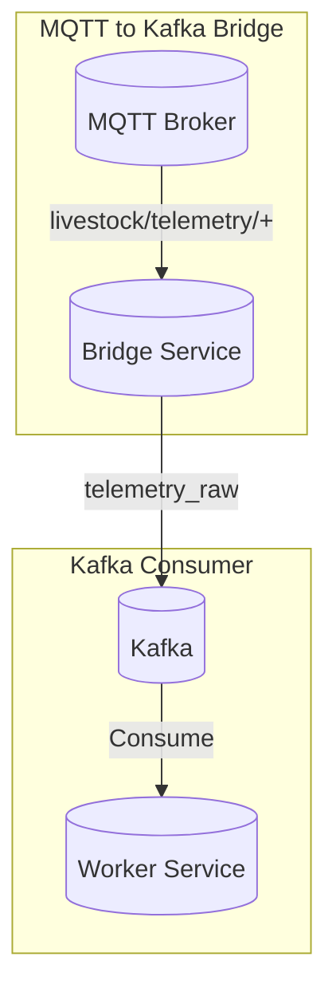
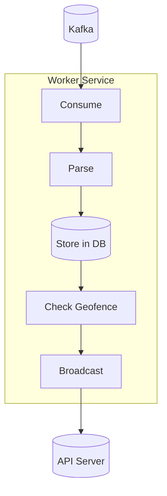

# Worker Services Documentation

The platform includes background worker services for processing telemetry data.

## Overview



## Processing Flow



## MQTT to Kafka Bridge

**File:** `app/worker/mqtt_to_kafka_bridge.py`

### Purpose

Subscribes to MQTT topics and forwards messages to Kafka for processing.

### How It Works

1. Connects to MQTT broker
2. Subscribes to `livestock/telemetry/#` (all belt topics)
3. Receives telemetry messages
4. Serializes to Protocol Buffer format
5. Produces to Kafka `telemetry_raw` topic

### Configuration

```python
class MqttToKafkaBridge:
    def __init__(
        self,
        mqtt_host: str,           # mosquitto
        mqtt_port: int,           # 1883
        mqtt_topic: str,          # livestock/telemetry/#
        kafka_bootstrap_servers: str,  # kafka:9092
        kafka_topic: str,        # telemetry_raw
    ):
```

### Message Format

MQTT message:
```json
{
  "belt_id": "BELT-001",
  "latitude": -36.595,
  "longitude": 144.945,
  "temperature": 38.5,
  "activity_level": 5.0,
  "timestamp": 1713724800
}
```

### Running

```bash
python -m app.worker.mqtt_to_kafka_bridge
```

## Kafka Consumer (Worker)

**File:** `app/worker/kafka_consumer.py`

### Purpose

Consumes telemetry from Kafka, stores in database, checks geofence, broadcasts to clients.

### How It Works

1. Subscribes to Kafka `telemetry_raw` topic
2. Consumes messages
3. Parses protobuf or JSON
4. Stores in TimescaleDB
5. Checks geofence compliance
6. Broadcasts to WebSocket clients

### Processing Flow

```
Kafka Message
    │
    ▼
┌────────────────┐
│ Parse Message   │  protobuf or JSON
└──────┬───────┘
       │
       ▼
┌────────────────┐
│ Store in DB    │  TimescaleDB
└──────┬───────┘
       │
       ▼
┌────────────────┐
│ Check Geofence │  PostGIS ST_Contains
└──────┬───────┘
       │
       ▼
┌────────────────┐
│ Broadcast WS   │  HTTP to API
└──────┬───────┘
       │
       ▼
Process Next
```

### Geofence Checking

The geofence check uses PostGIS:

```python
def check_geofence(self, belt_id, latitude, longitude):
    # Get animal's current paddock
    animal = db.query(Animal).filter(Animal.belt_id == belt_id).first()
    
    # Get paddock geometry
    paddock = db.query(Paddock).filter(Paddock.id == animal.current_paddock_id).first()
    
    # Check if point is inside polygon
    query = """
        SELECT ST_Contains(
            ST_GeomFromEWKT(:paddock_geom),
            ST_GeomFromEWKT(:point_geom)
        ) AS is_within
    """
    # Returns True if inside paddock
```

### Broadcasting

```python
async def _broadcast_telemetry(self, belt_id, latitude, longitude, temperature, activity_level, timestamp):
    async with aiohttp.ClientSession() as session:
        payload = {
            "type": "telemetry",
            "belt_id": belt_id,
            "latitude": latitude,
            "longitude": longitude,
            "temperature": temperature,
            "activity_level": activity_level,
            "timestamp": timestamp,
        }
        async with session.post(
            "http://api:8000/internal/broadcast-telemetry",
            json=payload
        ) as resp:
            pass
```

### Running

```bash
python -m app.worker.kafka_consumer
```

## Geofence Service

**File:** `app/worker/geofence_service.py`

### Purpose

Checks if an animal is within its assigned paddock.

### Usage

```python
from app.worker.geofence_service import GeofenceService

geofence_service = GeofenceService(db)
is_within, breached_paddock_id = geofence_service.check_geofence(
    belt_id="BELT-001",
    latitude=-36.595,
    longitude=144.945
)

if not is_within:
    # Create alert
    alert = geofence_service.create_breach_alert(
        belt_id="BELT-001",
        latitude=-36.595,
        longitude=144.945,
        paddock_id=breached_paddock_id
    )
```

## Running Workers

### Using Docker Compose

```bash
# Start all workers
docker-compose up -d bridge worker

# View worker logs
docker-compose logs -f worker

# View bridge logs
docker-compose logs -f bridge
```

### Running Locally

```bash
# Terminal 1: Start MQTT to Kafka bridge
python -m app.worker.mqtt_to_kafka_bridge

# Terminal 2: Start Kafka consumer
python -m app.worker.kafka_consumer
```

## Troubleshooting

### Bridge not receiving MQTT messages

```bash
# Check MQTT broker
docker-compose logs mosquitto

# Check subscription
docker-compose exec bridge python -c "
from app.core.config import settings
print(f'MQTT Topic: {settings.mqtt_topic}')
"
```

### Worker not consuming Kafka messages

```bash
# Check Kafka topic
docker-compose exec kafka kafka-topics --list --bootstrap-server localhost:9092

# Check consumer group
docker-compose exec kafka kafka-consumer-groups --list --bootstrap-server localhost:9092

# Manually test consumer
docker exec worker python -c "
from confluent_kafka import Consumer
c = Consumer({'bootstrap.servers': 'kafka:9092', 'group.id': 'test'})
c.subscribe(['telemetry_raw'])
msg = c.poll(timeout=5)
print(msg.value() if msg else 'No message')
"
```

### Database connection issues

```bash
# Check PostgreSQL
docker-compose exec postgres pg_isready

# Check TimescaleDB
docker-compose exec timescale pg_isready

# Test connection
docker exec worker python -c "
from app.core.database import SessionLocal, TimescaleSessionLocal
db = SessionLocal()
print('PostgreSQL OK')
db.close()
db = TimescaleSessionLocal()
print('TimescaleDB OK')
"
```